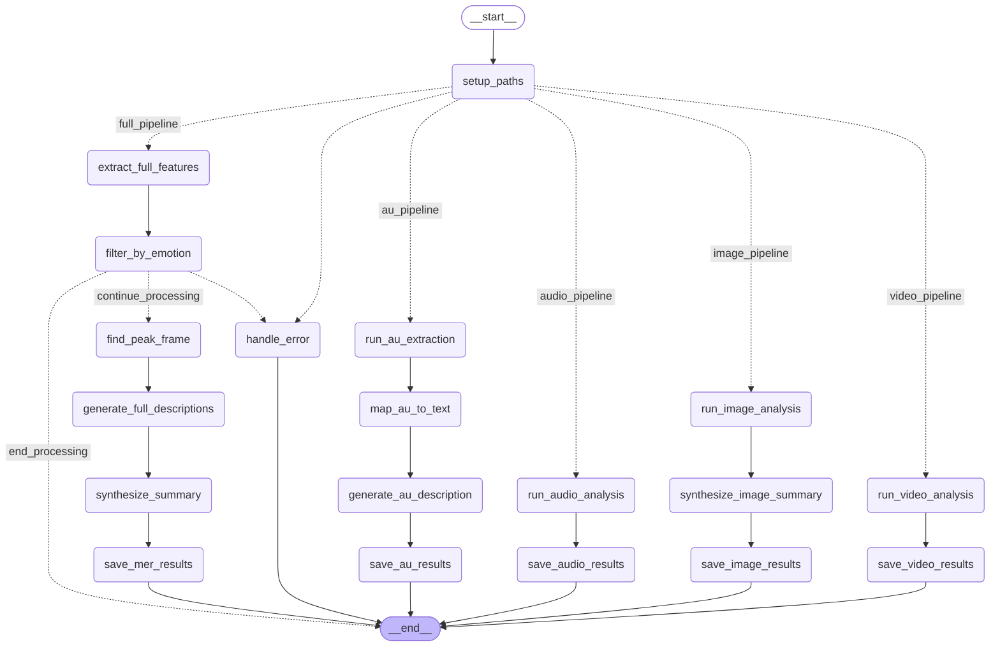
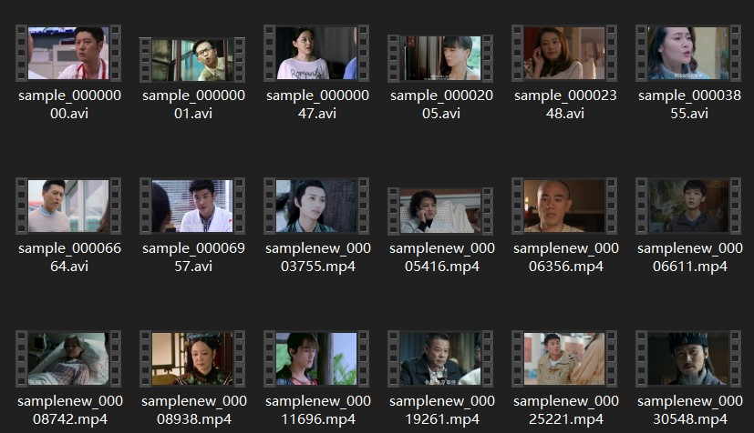

# Multimodal emotion recognition and reasoning  

We release the MERR dataset contruction strategy at [MER-Dataset-Builder](https://github.com/Lum1104/MER-Dataset-Builder), thanks to @Lum1104.

Try out our MER-Dataset-Builder

## Data source  

MER2023-SEMI contains over 70,000 unlabeled video clips. We utilize several powerful multimodal models to extract emotional cues from different modalities, and then use the latest LLaMA-3 model to summarize all emotional cues for inference, resulting in the final multimodal description.   

## MERR Dataset Construction  

### 1. Data Filtering  

We employed OpenFace to extract faces from video segments, which were then aligned to identify various facial muscle movements, resulting in the detection of Action Units. Certain combinations of these muscle movements correlate with specific emotions. For instance, the emotion of surprise is identified through the combination of Action Unit 05 (upper lid raiser) and 26 (jaw drop). Each specific combination of Action Units was assigned a pseudo-label, signifying that the sample was selected and exhibited strong emotional expression characteristics. In total, 28,618 samples were selected and assigned pseudo-labels.

### 2. Visual Expression Description  

Due to the natural actions such as blinking and speaking in the videos, different combinations of Action Units (AUs) are extracted from various frames. Thus, determining the AUs that most accurately represent the current emotion is crucial. Our approach involves analyzing the amplitude values of the Action Units to identify the peak of emotional expression, termed the "emotional peak frame." The specific steps include: (1) identifying the most frequently occurring Action Units across all frames; (2) summing their values, with the highest total indicating the emotional peak frame. The Action Units of this frame are then mapped to their corresponding visual expression descriptions.

### 3. Visual Objective Description  

We input a complete emotional peak frame into the [MiniGPT-v2](https://github.com/Vision-CAIR/MiniGPT-4/blob/main/demo_v2.py) model, enabling it to describe the scene, character gestures, and other aspects of the video.

### 4. Audio Tone Description  

We use audio as input for the [Qwen-Audio](https://www.modelscope.cn/models/qwen/QWen-Audio/summary) model, which then describes the speaker's tone and intonation, yielding audio clues that are equally crucial for understanding the emotion.

### 5. Coarse-Grained Synthesis  

By integrating visual and audio descriptions with lexical subtitles in a templated sequence, we generate a coarse-grained emotional description. In total, 28,618 such descriptions were produced.

### 6. Fine-Grained Generation  

Merely concatenating components does not truly explain the triggers behind emotions. Therefore, we input all emotional clues into the [LLaMA-3](https://huggingface.co/meta-llama/Meta-Llama-3-8B-Instruct) model to sift through and correctly identify relevant clues, combining different ones for inference, and thus deriving a comprehensive emotional description.

Since the emotional clues previously gathered were unverified, they included some erroneous or contradictory descriptions. Using the output from LLaMA-3, we could easily filter out these samples. Additionally, we removed some samples due to an overabundance, often caused by duplicates in the original dataset. We also randomly selected some from the neutral samples to enrich our dataset.

Through these processes, the final MERR dataset contains 4,487 samples along with their corresponding detailed multimodal descriptions.An example of the annotation for one sample is displayed as follows:

## Limitations

- During the data annotation process, only two "disgust" samples were identified. Due to their limited number, we chose not to include them in the MERR dataset. We plan to explore more effective data filtering techniques to uncover more samples of less common emotions.

- In our tests and usage, Qwen-Audio performed exceptionally well among various large audio models. However, since these models are not specifically trained on emotional content, many errors are present in the emotion descriptions. Further research into the application of large audio models in emotion recognition is needed.

## MER-Dataset-Builder

### Features

- **AU Pipeline**: Extract facial Action Units and generate natural language descriptions
- **Audio Pipeline**: Extract audio, transcribe speech, and analyze tone
- **Video Pipeline**: Generate comprehensive video content descriptions  
- **Image Pipeline**: End-to-end emotion recognition with image description and emotional synthesis
- **MER Pipeline**: Full end-to-end multimodal emotion recognition with peak frame detection and emotional synthesis

Examples of MERR by different MLLM can be found at [bakllava_llama3.2_merr.json](https://github.com/Lum1104/MER-Dataset-Builder/blob/main/examples/bakllava_llama3.2_merr.json) and [gemini_merr.json](https://github.com/Lum1104/MER-Dataset-Builder/blob/main/examples/gemini_merr.json)