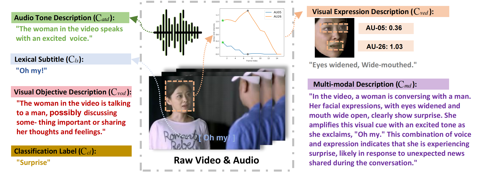
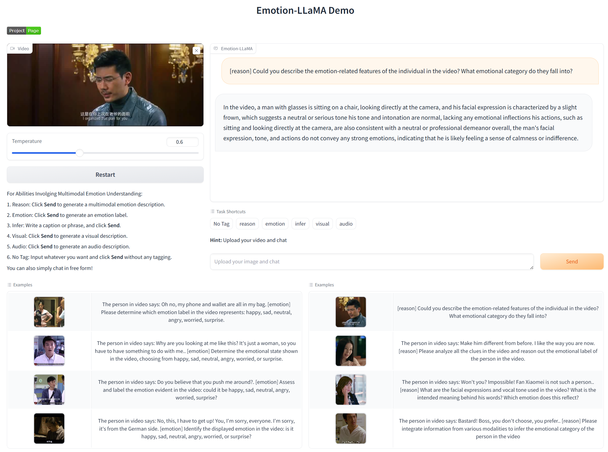
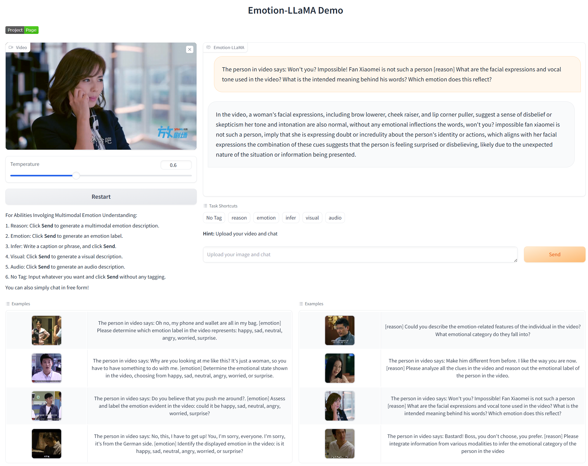
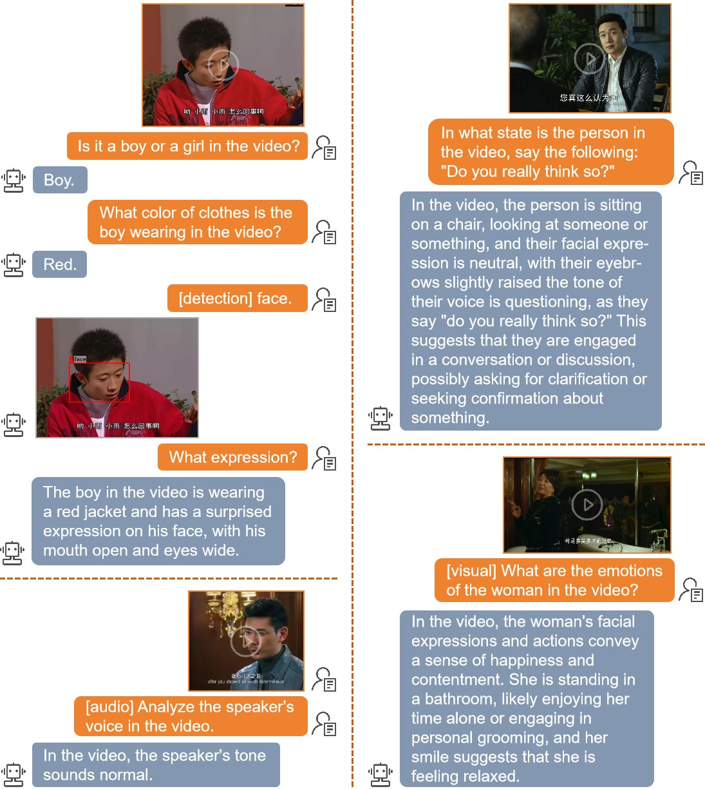

# Emotion-LLaMA: Multimodal Emotion Recognition and Reasoning with Instruction Tuning  

## 📢 News
[2024.09.27] 🎉🎉🎉 Our Emotion-LLaMA has been accepted at NIPS 2024!   
[2024.09.07] 🥉🥉🥉 We achieved third place in the MER-OV track of the MER2024 Challenge. Emotion-LLaMA is the highest-scoring model among all individual models.  
[2024.07.10] 🏆🏆🏆 Building on Emotion-LLaMA, we won the championship in the MER-Noise track of the MER2024 Challenge.  
[2024.06.12] 🔥🔥🔥 We have deployed an online demo of Emotion-LLaMA on Hugging Face.  
 

## 🚀 Overview

  Accurate emotion perception is crucial for various applications, including human-computer interaction, education, and counseling. However, traditional single-modality approaches often fail to capture the complexity of real-world emotional expressions, which are inherently multimodal. Moreover, existing Multimodal Large Language Models (MLLMs) face challenges in integrating audio and recognizing subtle facial micro-expressions.

To address these issues, we introduce the **MERR dataset**, containing 28,618 coarse-grained and 4,487 fine-grained annotated samples across diverse emotional categories. This dataset enables models to learn from varied scenarios and generalize to real-world applications.

Additionally, we propose **Emotion-LLaMA**, a model that seamlessly integrates audio, visual, and textual inputs through emotion-specific encoders. By aligning features into a shared space and employing a modified LLaMA model with instruction tuning, Emotion-LLaMA significantly enhances both emotional recognition and reasoning capabilities.

Extensive evaluations demonstrate that Emotion-LLaMA outperforms other MLLMs, achieving top scores in Clue Overlap (7.83) and Label Overlap (6.25) on EMER, an F1 score of  0.9036 on the MER2023 challenge, and the highest UAR (45.59) and WAR (59.37) in zero-shot evaluations on the DFEW dataset.

More details about Emotion-LLaMA, please refer to this [paper](https://arxiv.org/pdf/2406.11161). Feel free to contact us if you have any question.

## 📊 MERR Dataset

### 📈 Comparison of Emotional Datasets

The MERR dataset extends the range of emotional categories and annotations beyond those found in existing datasets. Each sample is annotated with an emotion label and described in terms of its emotional expression. Download the annotation content of [the MERR dataset](https://drive.google.com/drive/folders/1LSYMq2G-TaLof5xppyXcIuWiSN0ODwqG?usp=sharing).


### 📝 Example of the MERR Dataset

The dataset was initially auto-annotated with coarse-grained labels for 28,618 samples from a large pool of unannotated data, and later refined to include 4,487 samples with fine-grained annotations. For more details on the data annotation process, see [MERR Dataset Construction](./MERR/README.md).



## 🧠 Emotion-LLaMA


## 🛠️ Setup

### Preparing the Code and Environment

```bash
git clone https://github.com/ZebangCheng/Emotion-LLaMA.git
cd Emotion-LLaMA
conda env create -f environment.yaml
conda activate llama
```

### Preparing the Pretrained LLM Weights

Download the Llama-2-7b-chat-hf model from Huggingface to `Emotion-LLaMA/checkpoints/`:

```
> https://huggingface.co/meta-llama/Llama-2-7b-chat-hf  
```

Specify the path to Llama-2 in the [model config file](minigpt4/configs/models/minigpt_v2.yaml#L14):

```yaml
# Set Llama-2-7b-chat-hf path
llama_model: "/home/user/project/Emotion-LLaMA/checkpoints/Llama-2-7b-chat-hf"
```

Specify the path to MiniGPT-v2 in the [config file](train_configs\Emotion-LLaMA_finetune.yaml#L9):

```yaml
# Set MiniGPT-v2 path
ckpt: "/home/user/project/Emotion-LLaMA/checkpoints/minigptv2_checkpoint.pth"
```

You can refer to the path displayed in [Project Overview](./Overview.md) for storing the downloaded file.

## 🎬 Demo

### Online Demo

You can experience the powerful emotion recognition capabilities of Emotion-LLaMA through the [online demo](https://huggingface.co/spaces/ZebangCheng/Emotion-LLaMA).

<!--  -->
  

Detailed examples of general tasks performed by the Emotion-LLaMA.

  

Detailed examples of multimodal emotion recognition and reasoning performed by the Emotion-LLaMA.

  

### Local Demo
1.Download the HuBERT-large model from Huggingface to `Emotion-LLaMA/checkpoints/transformer/`:

> https://huggingface.co/TencentGameMate/chinese-hubert-large


2.Specify the path to HuBERT-large in the [conversation file](minigpt4/conversation/conversation.py#L263):

```yaml
# Set HuBERT-large model path
model_file = "checkpoints/transformer/chinese-hubert-large"
```

3.Download the Emotion-LLaMA demo model from Googel Drive to `Emotion-LLaMA/checkpoints/save_checkpoint/`:

> https://drive.google.com/file/d/1pNngqXdc3cKr9uLNW-Hu3SKvOpjzfzGY/view?usp=sharing  


4.Specify the path to Emotion-LLaMA in the [demo config file](eval_configs/demo.yaml#L10):

```yaml
# Set Emotion-LLaMA path
ckpt: "/home/user/project/Emotion-LLaMA/checkpoints/save_checkpoint/Emoation_LLaMA.pth"
```

5.Install the required packages:  
```
pip install moviepy==1.0.3
pip install soundfile==0.12.1
pip install opencv-python==4.7.0.72
```

6.Launching Demo Locally
```
python app.py

# After running the code, click the following link to experience the demo webpage: 
# Running on local URL: http://127.0.0.1:7860
```


## 💡 Training

**1. Downloading the Dataset**
Due to copyright restrictions, we are unable to provide the raw videos or extracted images. Please visit the official MER2023 website to apply for access to the dataset.
> http://merchallenge.cn/datasets  

Then specify the path to Dataset in the [dataset config file](minigpt4\configs\datasets\firstface\featureface.yaml#L7):

```yaml
# Set Dataset video path
image_path: /home/czb/big_space/datasets/Emotion/MER2023/video
```

**2. Prepare Multi-modal Encoders**
To extract rich and comprehensive emotion features, we use the HuBERT model as the Audio Encoder, the EVA model as the Global Encoder, the MAE model as the Local Encoder, and the VideoMAE model as the Temporal Encoder. In practice, to save GPU memory, we do not load all Encoders directly onto the GPU but instead load the extracted features. You can download the processed feature files through the following Google Drive link and save them to the dataset folder.

> https://drive.google.com/drive/folders/1DqGSBgpRo7TuGNqMJo9BYg6smJE20MG4?usp=drive_link
  

Please modify the `get()` function in the [dataset file](minigpt4/datasets/datasets/first_face.py#L161) to set the path for reading the features.

The specific feature extraction process can be referenced in the contents of the "feature_extract" folder. Detailed instructions will come soon.
> https://drive.google.com/drive/folders/1d-Sg5fAskt2s6OOEUNXFaM2u-C055Whj?usp=sharing


**3. Set dataset configuration**  
In the [dataset configuration file](minigpt4\configs\datasets\firstface\featureface.yaml#L10), select the use of MERR_coarse_grained.txt. There are a total of 28,618 coarse-grained video samples for the first stage of training.


**4. Prepare Multi-task Instruction**  

First, set the type of tasks in the [dataset file](minigpt4/datasets/datasets/first_face.py#L61):
```python
self.task_pool = [
    "emotion",
    "reason",
    # "reason_v2",
]
```
Here, the "emotion" task represents a multi-modal emotion recognition task, while the "reason" task represents a multi-modal emotion inference task. Different tasks will randomly select different prompts from different instruction pools.


**5. Run**  
Run the following code to pre-train Emotion-LLaMA:  
```bash
CUDA_VISIBLE_DEVICES=0,1,2,3 torchrun --nproc-per-node 4 train.py --cfg-path train_configs/Emotion-LLaMA_finetune.yaml
```

**6. Next Steps**  
If you would like to experience the instruction-tuning process and see the performance of Emotion-LLaMA on emotion reasoning tests with the EMER dataset, please refer to Stage 2.


## 🧪 Evaluation

### MER2023 Challenge

To further validate the effectiveness of the Emotion-LLaMA model, we conducted experiments using the MER2023 Challenge dataset and compared our results with previous state-of-the-art supervised methods. The outcomes show that our model, which maps audio and visual features to textual space, achieves the highest F1 score across various modalities. Our results can be replicated using the following steps.

|Method                 | Modality | F1 Score |
| :--------------       | :------: | :------: |
wav2vec 2.0             | A        |  0.4028  |
VGGish                  | A        |  0.5481  |
HuBERT                  | A        |  0.8511  |
ResNet                  | V        |  0.4132  |
MAE                     | V        |  0.5547  |
VideoMAE                | V        |  0.6068  |
RoBERTa                 | T        |  0.4061  |
BERT                    | T        |  0.4360  |
MacBERT                 | T        |  0.4632  |
MER2023-Baseline        | A, V     |  0.8675  |
MER2023-Baseline        | A, V, T  |  0.8640  |
Transformer             | A, V, T  |  0.8853  |
FBP                     | A, V, T  |  0.8855  |
VAT                     | A, V     |  0.8911  |
Emotion-LLaMA (ours)    | A, V     |  0.8905  |
**Emotion-LLaMA (ours)**| **A, V, T** | **0.9036** |

Specify the path to the pretrained checkpoint of Emotion-LLaMA in the [evaluation config file](eval_configs/eval_emotion.yaml#L8):

```yaml
# Set pretrained checkpoint path
llama_model: "/home/user/project/Emotion-LLaMA/checkpoints/Llama-2-7b-chat-hf"
ckpt: "/home/user/project/Emotion-LLaMA/checkpoints/save_checkpoint/stage2/checkpoint_best.pth"
```

Run the following code to evaluate the F1 score on MER2023-SEMI:

```bash
torchrun --nproc_per_node 1 eval_emotion.py --cfg-path eval_configs/eval_emotion.yaml --dataset feature_face_caption
```

### EMER Dataset
Comparison of multimodal emotion reasoning results on the EMER dataset. Clue Overlap and Label Overlap scores range from 0 to 10. Emotion-LLaMA excels beyond these models across both Clue Overlap and Label Overlap.  

|Models                    | Clue Overlap | Label Overlap |
| :--------------          | :----------: | :----------:  |
|VideoChat-Text            |    6.42      |     3.94      | 
|Video-LLaMA               |    6.64      |     4.89      | 
|Video-ChatGPT             |    6.95      |     5.74      | 
|PandaGPT                  |    7.14      |     5.51      | 
|VideoChat-Embed           |    7.15      |     5.65      | 
|Valley                    |    7.24      |     5.77      | 
|**Emotion-LLaMA (ours)**  |  **7.83**    |   **6.25**    | 

### MER2024 Challenge
Emotion-LLaMA similarly achieved state-of-the-art performance, recording an F1 score of 84.52 in the MER-NOISE track. Subsequently, our team, SZTU-CMU, used the results from Emotion-LLaMA as pseudo-labels to secure the championship.     
| Teams       |   Score       |
| :---------- | :----------:  |
| SZTU-CMU	  |   0.8530 (1)  |
| BZL arc06	  |   0.8383 (2)  |
| VIRlab		  |   0.8365 (3)  |
| T_MERG	    |   0.8271 (4)  |
| AI4AI		    |   0.8128 (5)  |
| USTC-IAT	  |   0.8066 (6)  |
| fzq		      |   0.8062 (7)  |
| BUPT-BIT	  |   0.8059 (8)  |
| Soul AI		  |   0.8017 (9)  |
| NWPU-SUST	  |   0.7972 (10) |
| iai-zjy		  |   0.7842 (11) |
| SJTU-XLANCE |   0.7835 (12) |
| ILR		      |   0.7833 (13) |
| ACRG_GL	    |   0.7782 (14) |

Specify the path to the pretrained checkpoint of Emotion-LLaMA in the [evaluation config file](eval_configs/eval_emotion.yaml#L8):

```yaml
# Set pretrained checkpoint path
llama_model: "/home/user/project/Emotion-LLaMA/checkpoints/Llama-2-7b-chat-hf"
ckpt: "/home/user/project/Emotion-LLaMA/checkpoints/save_checkpoint/stage2/MER2024-best.pth"
```

Run the following code to evaluate the F1 score on MER2024-NOISE:

```bash
torchrun  --nproc_per_node 1 eval_emotion.py --cfg-path eval_configs/eval_emotion.yaml --dataset mer2024_caption
```

## 🙏 Acknowledgements

- [MiniGPT-v2](https://arxiv.org/abs/2310.09478): Large Language Model as a Unified Interface for Vision-Language Multi-task Learning.
- [AffectGPT](https://arxiv.org/abs/2306.15401): Explainable Multimodal Emotion Recognition.
- [LLaVA](https://llava-vl.github.io/): Large Language-and-Vision Assistant.


## ✒️ Citation
If you find our work helpful for your research, please consider giving a star  and citation 
```bibtex
@article{cheng2024emotion,
  title={Emotion-LLaMA: Multimodal Emotion Recognition and Reasoning with Instruction Tuning},
  author={Cheng, Zebang and Cheng, Zhi-Qi and He, Jun-Yan and Sun, Jingdong and Wang, Kai and Lin, Yuxiang and Lian, Zheng and Peng, Xiaojiang and Hauptmann, Alexander},
  journal={arXiv preprint arXiv:2406.11161},
  year={2024}
}
```


## 📜 License
This repository is under the [BSD 3-Clause License](./LICENSE.md). Code is based on MiniGPT-4 with BSD 3-Clause License [here](./LICENSE_MiniGPT4.md). Data is from MER2023 and licensed under [EULA](./LICENSE_EULA.md) for research purposes only.
