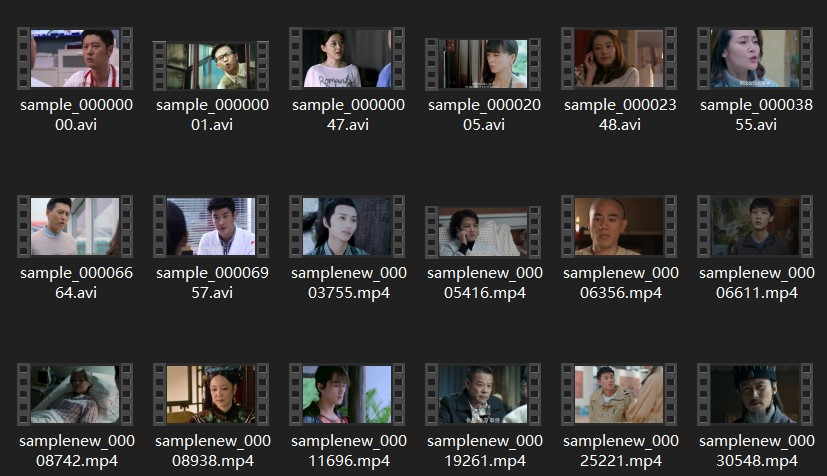
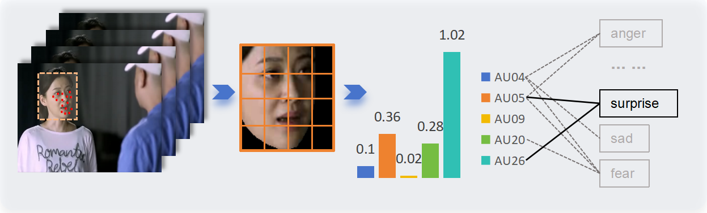
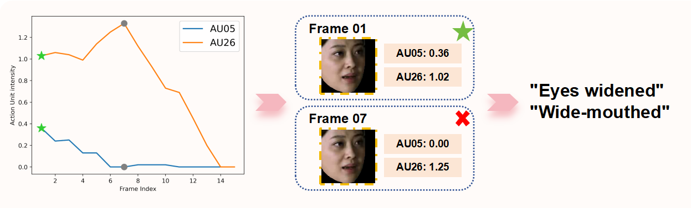
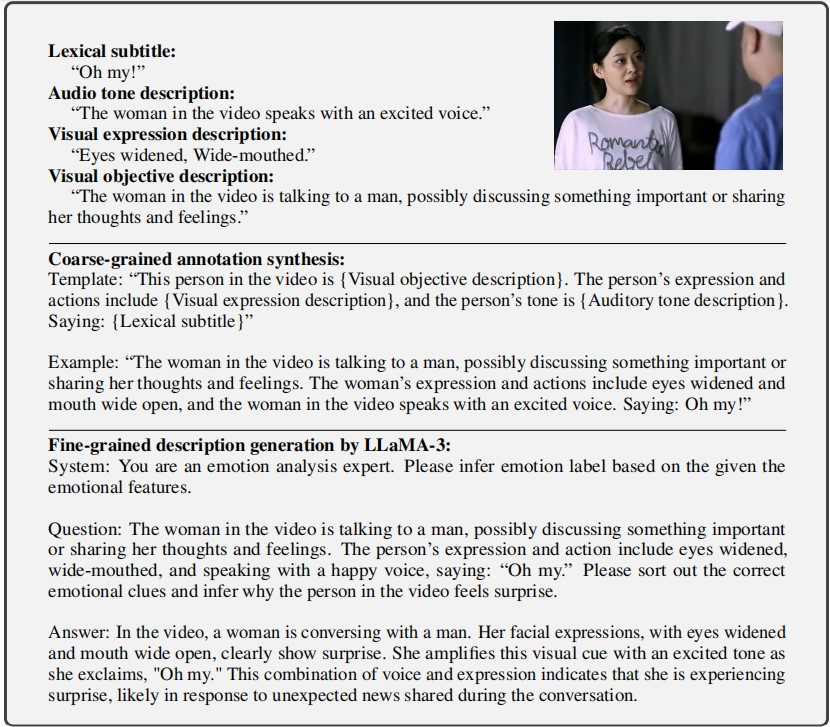

# MERR Dataset Construction
{: .no_toc }

A detailed guide on how the MERR dataset was constructed using our automated pipeline.
{: .fs-6 .fw-300 }

---

## Table of Contents
{: .no_toc .text-delta }

1. TOC
{:toc}

---

## Construction Pipeline

We built a unified MER dataset construction pipeline called [MER-Factory](https://github.com/Lum1104/MER-Factory). 

Full documentation is available at: [MER-Factory Documentation](https://lum1104.github.io/MER-Factory/)

---

## Data Source

The MERR dataset is constructed from **MER2023-SEMI**, which contains over 70,000 unlabeled video clips. We utilize several powerful multimodal models to extract emotional cues from different modalities, and then use the LLaMA-3 model to summarize all emotional cues for inference, resulting in the final multimodal description.



---

## Construction Steps

### Step 1: Data Filtering

We employed **OpenFace** to extract faces from video segments, which were then aligned to identify various facial muscle movements, resulting in the detection of **Action Units (AUs)**.

Certain combinations of these muscle movements correlate with specific emotions:
- **Surprise**: AU05 (upper lid raiser) + AU26 (jaw drop)
- **Happiness**: AU06 (cheek raiser) + AU12 (lip corner puller)
- **Sadness**: AU01 (inner brow raiser) + AU04 (brow lowerer) + AU15 (lip corner depressor)
- **Anger**: AU04 (brow lowerer) + AU05 (upper lid raiser) + AU07 (lid tightener) + AU23 (lip tightener)

Each specific combination of Action Units was assigned a pseudo-label, signifying that the sample was selected and exhibited strong emotional expression characteristics.

**Result**: 28,618 samples were selected and assigned pseudo-labels.



---

### Step 2: Visual Expression Description

Due to natural actions such as blinking and speaking in the videos, different combinations of Action Units are extracted from various frames. Thus, determining the AUs that most accurately represent the current emotion is crucial.

Our approach involves analyzing the amplitude values of the Action Units to identify the **"emotional peak frame"**:

1. **Identify** the most frequently occurring Action Units across all frames
2. **Sum** their amplitude values
3. **Select** the frame with the highest total as the emotional peak frame
4. **Map** the Action Units of this frame to their corresponding visual expression descriptions



---

### Step 3: Visual Objective Description

We input the complete emotional peak frame into the [MiniGPT-v2](https://github.com/Vision-CAIR/MiniGPT-4/blob/main/demo_v2.py) model, enabling it to describe:
- Scene context
- Character gestures and postures
- Environmental factors
- Visual details

**Example output:**
```
A person is sitting in a dimly lit room, their face showing signs of distress 
with furrowed brows and a slight frown. Their body posture is tense, with 
shoulders slightly hunched forward.
```

---

### Step 4: Audio Tone Description

We use audio as input for the [Qwen-Audio](https://www.modelscope.cn/models/qwen/QWen-Audio/summary) model, which then describes:
- Speaker's tone and intonation
- Voice quality (pitch, volume, speed)
- Emotional prosody
- Acoustic patterns

These audio clues are equally crucial for understanding the emotion.

**Example output:**
```
The speaker's voice is trembling slightly, with a lower pitch and slower pace, 
indicating a sad or distressed emotional state.
```

{: .note }
> While Qwen-Audio performs well among various large audio models, some errors are present in emotion descriptions since these models are not specifically trained on emotional content.

---

### Step 5: Coarse-Grained Synthesis

By integrating visual and audio descriptions with lexical subtitles in a templated sequence, we generate a coarse-grained emotional description.

**Template structure:**
```
[Visual Expression] + [Audio Tone] + [Textual Content] → Emotion Label
```

**Result**: 28,618 coarse-grained descriptions were produced.

**Example coarse-grained annotation:**
```
Visual: Furrowed brows, slight frown, tense posture
Audio: Trembling voice, lower pitch, slower pace
Text: "I can't believe this is happening..."
Label: Sadness
```

---

### Step 6: Fine-Grained Generation

Merely concatenating components does not truly explain the triggers behind emotions. Therefore, we input all emotional clues into the [LLaMA-3](https://huggingface.co/meta-llama/Meta-Llama-3-8B-Instruct) model to:

1. **Sift through** and correctly identify relevant clues
2. **Combine** different cues for inference
3. **Generate** comprehensive emotional descriptions
4. **Filter** erroneous or contradictory descriptions

Since the emotional clues previously gathered were unverified, they included some erroneous or contradictory descriptions. Using the output from LLaMA-3, we could easily filter out these samples.

Additionally, we:
- Removed duplicates from the original dataset
- Randomly selected neutral samples to enrich the dataset
- Balanced the distribution across emotion categories

**Result**: The final MERR dataset contains **4,487 samples** with detailed multimodal descriptions.

---

## Example Annotation

Here's a complete example of a fine-grained annotation:



The annotation includes:
- **Video ID**: sample_00000047
- **Emotion Label**: Happiness
- **Peak Frame**: Frame 23 (highest AU activation)
- **Action Units**: AU06 + AU12 (happiness indicators)
- **Visual Description**: "Genuine smile with raised cheeks and pulled lip corners"
- **Audio Description**: "Bright, higher-pitched voice with upward intonation"
- **Text**: "I'm so excited to share this news with you!"
- **Multimodal Reasoning**: "The combination of a genuine smile (Duchenne smile with AU06 and AU12), enthusiastic vocal tone, and positive language indicates strong happiness and excitement about sharing positive news."

---

## Quality Control

### Filtering Criteria

We applied multiple quality control measures:

1. **AU Confidence Threshold**: Only frames with AU detection confidence > 0.8
2. **Audio Quality**: Signal-to-noise ratio (SNR) > 20dB
3. **Video Quality**: Resolution ≥ 480p, clear facial visibility
4. **Text Quality**: Proper transcription with < 10% error rate
5. **Consistency Check**: Cross-modal consistency validation

### Human Verification

A subset of 500 samples was manually verified by human annotators:
- **Agreement rate**: 94.2% for coarse-grained labels
- **Agreement rate**: 91.8% for fine-grained descriptions

---

## Limitations

### Disgust Emotion

During the data annotation process, only **2 "disgust" samples** were identified. Due to their limited number, we chose not to include them in the MERR dataset. 

{: .warning }
> We plan to explore more effective data filtering techniques to uncover more samples of less common emotions.

### Audio Model Limitations

In our tests and usage, Qwen-Audio performed exceptionally well among various large audio models. However, since these models are not specifically trained on emotional content, many errors are present in the emotion descriptions.

{: .note }
> Further research into the application of large audio models in emotion recognition is needed.

### Language Limitation

The current dataset primarily contains Chinese language content with English translations. Expanding to more languages is part of future work.

---

## Future Improvements

We are actively working on:

1. **Emotion Coverage**: Techniques to identify rare emotions like disgust and contempt
2. **Audio Models**: Training emotion-specific audio analysis models
3. **Multilingual Support**: Expanding to multiple languages
4. **Real-world Scenarios**: Including more diverse contexts and situations
5. **Temporal Dynamics**: Better capturing emotion transitions over time

---

## Tools and Models Used

| Component | Model/Tool | Purpose |
|:----------|:-----------|:--------|
| Face Detection | OpenFace | Extract facial features and Action Units |
| Visual Description | MiniGPT-v2 | Generate scene and gesture descriptions |
| Audio Description | Qwen-Audio | Analyze tone and vocal characteristics |
| Fine-grained Generation | LLaMA-3 | Synthesize multimodal reasoning |
| Feature Extraction | HuBERT, EVA, MAE, VideoMAE | Extract multimodal features |

---

## Access the Pipeline

To use our dataset construction pipeline for your own data:

1. Visit [MER-Factory](https://github.com/Lum1104/MER-Factory)
2. Follow the [documentation](https://lum1104.github.io/MER-Factory/)
3. Customize the pipeline for your needs

---

## Questions?

For questions about the dataset construction process:
- Open an [issue on GitHub](https://github.com/ZebangCheng/Emotion-LLaMA/issues)
- Refer to the [MER-Factory documentation](https://lum1104.github.io/MER-Factory/)
- Contact the authors

