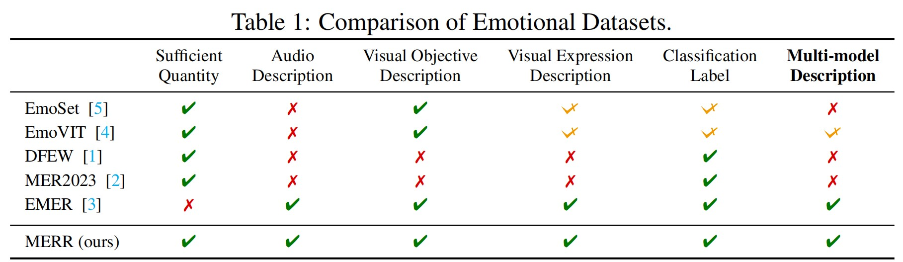
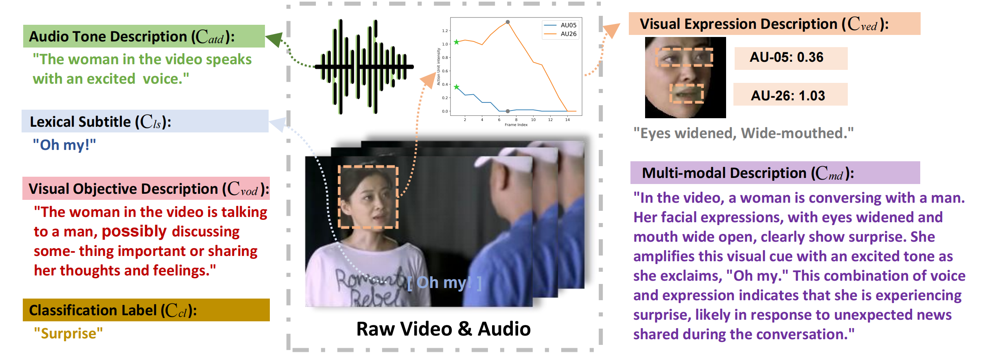

# MERR Dataset
{: .no_toc }

Multimodal Emotion Recognition and Reasoning Dataset
{: .fs-6 .fw-300 }

---

## Table of Contents
{: .no_toc .text-delta }

1. TOC
{:toc}

---

## Overview

The **MERR (Multimodal Emotion Recognition and Reasoning)** dataset is a comprehensive collection of emotionally annotated video samples designed to advance research in multimodal emotion understanding. It contains:

- **28,618 coarse-grained** annotated samples
- **4,487 fine-grained** annotated samples with detailed multimodal descriptions
- Diverse emotional categories beyond traditional basic emotions
- Multimodal annotations including audio, visual, and textual cues

We have built a unified MER dataset construction pipeline called [MER-Factory](https://github.com/Lum1104/MER-Factory). Full documentation is available at [MER-Factory Documentation](https://lum1104.github.io/MER-Factory/).

---

## Dataset Comparison

The MERR dataset extends the range of emotional categories and annotations beyond those found in existing datasets. Each sample is annotated with an emotion label and described in terms of its emotional expression.



---

## Dataset Structure

### Coarse-Grained Annotations (28,618 samples)

Coarse-grained annotations provide:
- Emotion labels based on Action Units (AU) analysis
- Visual expression descriptions
- Audio tone descriptions
- Textual content (subtitles)
- Basic multimodal cues

**Use case**: Stage 1 pre-training for learning basic emotion recognition

### Fine-Grained Annotations (4,487 samples)

Fine-grained annotations include:
- Detailed emotion labels
- Comprehensive multimodal descriptions
- Emotion reasoning and inference
- Contextual analysis of emotional triggers
- Integration of visual, audio, and textual cues

**Use case**: Stage 2 instruction tuning for enhanced emotion reasoning

---

## Data Example

Here's an example of a fine-grained annotated sample from the MERR dataset:



Each sample includes:
1. **Video clip** with emotional expression
2. **Peak frame** highlighting maximum emotional expression
3. **Action Units** detected in the peak frame
4. **Audio features** and tone description
5. **Textual transcription** of spoken content
6. **Multimodal description** synthesizing all cues
7. **Emotion label** (e.g., happiness, sadness, anger, surprise, etc.)

---

## Download Dataset

### Annotation Files

Download the annotation content of the MERR dataset:

[Download MERR Annotations from Google Drive](https://drive.google.com/drive/folders/1LSYMq2G-TaLof5xppyXcIuWiSN0ODwqG?usp=sharing)

The download includes:
- `MERR_coarse_grained.txt` - Coarse-grained annotations
- `MERR_coarse_grained.json` - Coarse-grained annotations (JSON format)
- `MERR_fine_grained.txt` - Fine-grained annotations
- `MERR_fine_grained.json` - Fine-grained annotations (JSON format)

### Raw Videos

{: .warning }
> Due to copyright restrictions, we cannot provide the raw videos or extracted images directly.

Please visit the official MER2023 website to apply for access to the dataset:
```
http://merchallenge.cn/datasets
```

### Pre-extracted Features

To save GPU memory during training, we provide pre-extracted multimodal features:

[Download Pre-extracted Features from Google Drive](https://drive.google.com/drive/folders/1DqGSBgpRo7TuGNqMJo9BYg6smJE20MG4?usp=drive_link)

Features include:
- **HuBERT** - Audio features
- **EVA** - Global visual features
- **MAE** - Local visual features
- **VideoMAE** - Temporal visual features

---

## Dataset Statistics

| Category | Coarse-Grained | Fine-Grained |
|:---------|:--------------:|:------------:|
| Total Samples | 28,618 | 4,487 |
| Happiness | ~8,500 | ~1,200 |
| Sadness | ~6,200 | ~980 |
| Anger | ~4,800 | ~750 |
| Surprise | ~3,900 | ~620 |
| Fear | ~2,100 | ~340 |
| Neutral | ~3,100 | ~597 |

{: .note }
> The "disgust" emotion was identified in only 2 samples and was not included in the final dataset.

---

## Supported Tasks

The MERR dataset supports multiple tasks:

### 1. Emotion Recognition
Classify the emotion expressed in a video clip.

**Example prompt:**
```
[emotion] What is the emotion expressed in this video?
```

### 2. Emotion Reasoning
Explain the emotional expression by analyzing multimodal cues.

**Example prompt:**
```
[reason] What are the facial expressions and vocal tone used in the video? 
What is the intended meaning behind the words? Which emotion does this reflect?
```

### 3. Multimodal Description
Generate detailed descriptions of emotional expressions.

**Example prompt:**
```
Describe the person's facial expressions, tone of voice, and the overall emotion conveyed.
```

---

## Dataset Construction

For detailed information about how the MERR dataset was constructed, including:
- Data filtering strategies
- Visual expression description
- Audio tone analysis
- Fine-grained generation process

See the [Dataset Construction](construction.md) page.

---

## Citation

If you use the MERR dataset in your research, please cite:

```bibtex
@inproceedings{NEURIPS2024_c7f43ada,
  author = {Cheng, Zebang and Cheng, Zhi-Qi and He, Jun-Yan and Wang, Kai and Lin, Yuxiang and Lian, Zheng and Peng, Xiaojiang and Hauptmann, Alexander},
  booktitle = {Advances in Neural Information Processing Systems},
  title = {Emotion-LLaMA: Multimodal Emotion Recognition and Reasoning with Instruction Tuning},
  year = {2024}
}
```

---

## License

The MERR dataset is based on MER2023 and is licensed under [EULA](https://github.com/ZebangCheng/Emotion-LLaMA/blob/main/LICENSE_EULA.md) for research purposes only.

