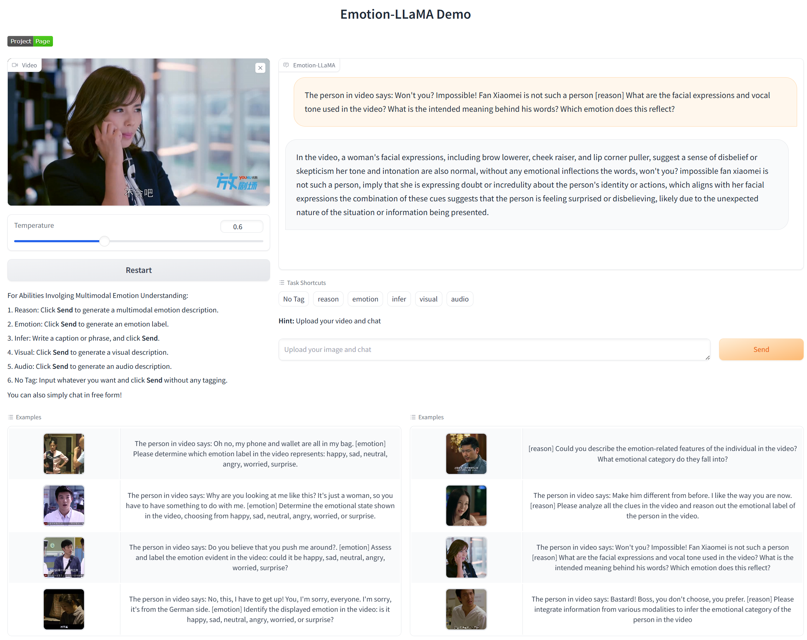
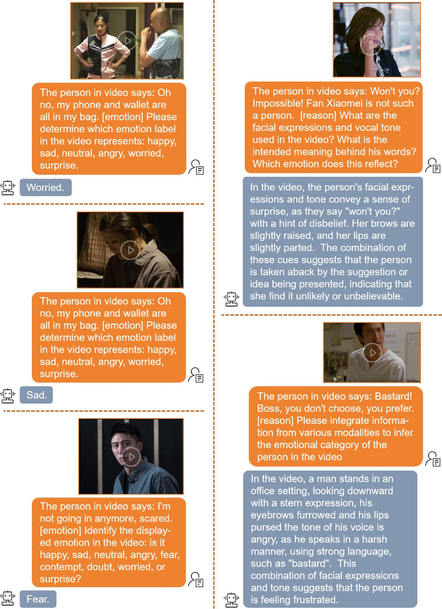
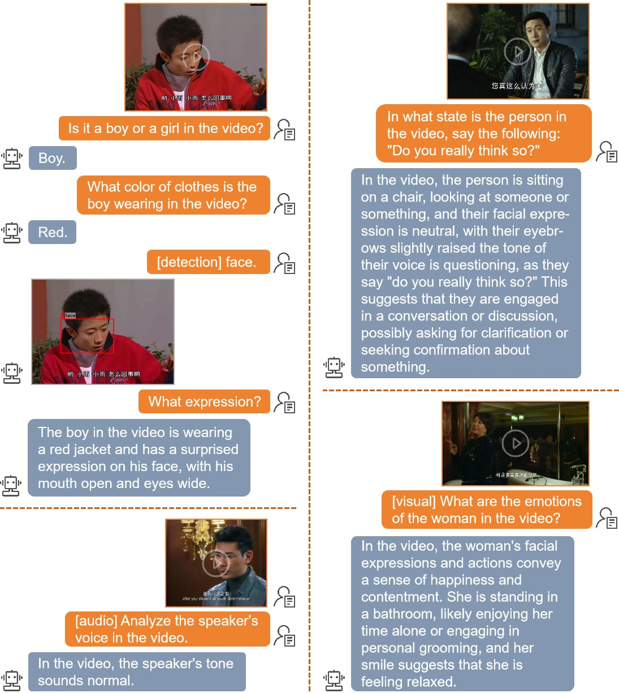

# Demo Usage
{: .no_toc }

Try Emotion-LLaMA through our online demo or run it locally.
{: .fs-6 .fw-300 }

---

## Table of Contents
{: .no_toc .text-delta }

1. TOC
{:toc}

---

## Online Demo

### Hugging Face Space

Experience Emotion-LLaMA without any installation:

🚀 **[Try the Online Demo](https://huggingface.co/spaces/ZebangCheng/Emotion-LLaMA)**

[](https://huggingface.co/spaces/ZebangCheng/Emotion-LLaMA)

### Features

- ✅ No installation required
- ✅ Upload your own videos
- ✅ Try example videos
- ✅ Real-time emotion recognition
- ✅ Detailed reasoning explanations



---

## Google Colab

Run Emotion-LLaMA in Google Colab with free GPU:

[](https://colab.research.google.com/drive/1YTSadgBRfn75wpgpor8_mYWcM6TUPF-i?usp=sharing)

### Colab Setup

1. Click the Colab badge above
2. Run all cells in sequence
3. Upload a video or use examples
4. Get emotion recognition results

{: .tip }
> Enable GPU in Colab: `Runtime` → `Change runtime type` → `Hardware accelerator: GPU`

---

## Local Demo

### Prerequisites

Before running the local demo, ensure you have:

- ✅ Completed [installation](../getting-started/)
- ✅ Downloaded required models
- ✅ At least 16GB GPU VRAM

### Installation Steps

**Step 1**: Download the HuBERT-large model:

```
https://huggingface.co/TencentGameMate/chinese-hubert-large
```

Save to `Emotion-LLaMA/checkpoints/transformer/chinese-hubert-large/`

**Step 2**: Configure the HuBERT path in `minigpt4/conversation/conversation.py`:

```python
# Set HuBERT-large model path
model_file = "checkpoints/transformer/chinese-hubert-large"
```

**Step 3**: Download the Emotion-LLaMA demo model:

[Download from Google Drive](https://drive.google.com/file/d/1pNngqXdc3cKr9uLNW-Hu3SKvOpjzfzGY/view?usp=sharing)

Save to `Emotion-LLaMA/checkpoints/save_checkpoint/Emoation_LLaMA.pth`

**Step 4**: Configure the model path in `eval_configs/demo.yaml`:

```yaml
# Set Emotion-LLaMA path
ckpt: "/path/to/Emotion-LLaMA/checkpoints/save_checkpoint/Emoation_LLaMA.pth"
```

**Step 5**: Install additional dependencies:

```bash
pip install moviepy==1.0.3
pip install soundfile==0.12.1
pip install opencv-python==4.7.0.72
```

### Launch the Demo

**Step 6**: Start the Gradio interface:

```bash
python app.py
```

**Step 7**: Open your browser and visit:

```
http://127.0.0.1:7860
```

{: .note }
> The first launch may take a few minutes to load all models into memory.

---

## Using the Demo

### Upload a Video

1. Click **"Upload Video"** button
2. Select a video file (MP4, AVI, MOV formats supported)
3. Wait for the video to load
4. Enter your prompt
5. Click **"Submit"**

### Example Videos

Try the pre-loaded example videos from `examples/`:

- `sample_00000167.mp4` - Happiness expression
- `sample_00000338.mp4` - Sadness expression
- `sample_00000669.mp4` - Anger expression
- `sample_00000727.mp4` - Surprise expression

---

## Prompt Examples

### Emotion Recognition

Simple emotion classification:

```
[emotion] What is the emotion expressed in this video?
```

Expected output:
```
The emotion expressed in this video is happiness.
```

### Emotion Reasoning

Detailed multimodal analysis:

```
[reason] What are the facial expressions and vocal tone used in the video? 
What is the intended meaning behind the words? Which emotion does this reflect?
```

Expected output:
```
The person displays a genuine smile with raised cheeks (AU06 + AU12), indicating 
happiness. The vocal tone is bright and enthusiastic with upward intonation. 
The words "I'm so excited!" combined with these multimodal cues strongly reflect 
joy and excitement.
```

### General Understanding

Ask open-ended questions:

```
Describe what the person is feeling and why.
```

```
What emotional state is being conveyed through facial expressions and tone?
```

```
Analyze the emotional content of this video.
```

---

## Demo Examples

### Emotion Recognition Tasks



The demo excels at:
- Recognizing primary emotions (happiness, sadness, anger, surprise, fear)
- Identifying mixed emotions
- Detecting subtle emotional expressions
- Understanding emotional intensity

### General Tasks



Beyond emotion recognition, the demo can:
- Describe scenes and contexts
- Analyze gestures and body language
- Understand social interactions
- Provide detailed video descriptions

---

## Advanced Usage

### Adjusting Generation Parameters

Modify `app.py` to customize generation:

```python
# Temperature (higher = more creative, lower = more focused)
temperature = 0.7  # Default: 0.7, Range: 0.1-1.0

# Max new tokens (longer responses)
max_new_tokens = 300  # Default: 300

# Top-p sampling (nucleus sampling)
top_p = 0.9  # Default: 0.9

# Repetition penalty
repetition_penalty = 1.0  # Default: 1.0
```

### Batch Processing

Process multiple videos programmatically:

```python
import glob
from app import process_video_question

videos = glob.glob("examples/*.mp4")
prompt = "[emotion] What is the emotion expressed in this video?"

results = {}
for video_path in videos:
    result = process_video_question(video_path, prompt)
    results[video_path] = result
    print(f"{video_path}: {result}")
```

---

## API Integration

For programmatic access, see the [API Documentation](../api/).

Quick example:

```python
import requests
import json

url = "http://127.0.0.1:7889/api/predict/"
headers = {"Content-Type": "application/json"}

data = {
    "data": [
        "/path/to/video.mp4",
        "[emotion] What emotion is expressed?"
    ]
}

response = requests.post(url, headers=headers, data=json.dumps(data))
print(response.json())
```

---

## Troubleshooting

### Common Issues

**Issue**: "CUDA out of memory"
- **Solution**: Close other GPU-intensive applications or use a smaller model

**Issue**: "Video format not supported"
- **Solution**: Convert video to MP4 format using ffmpeg:
  ```bash
  ffmpeg -i input.avi -c:v libx264 output.mp4
  ```

**Issue**: "Demo takes too long to respond"
- **Solution**: 
  - Use shorter videos (< 30 seconds)
  - Reduce `max_new_tokens` in generation config
  - Ensure GPU is being used (check with `nvidia-smi`)

**Issue**: "Model generates generic responses"
- **Solution**: 
  - Use more specific prompts
  - Try different prompt formats (`[emotion]`, `[reason]`)
  - Ensure you're using the correct checkpoint

### Performance Optimization

**Speed up inference**:

```python
# In app.py, enable these optimizations
torch.backends.cudnn.benchmark = True
torch.backends.cuda.matmul.allow_tf32 = True
```

**Reduce memory usage**:

```python
# Use half precision (FP16)
model = model.half()
```

---

## Demo Variants

### Minimal Demo (app_EmotionLlamaClient.py)

Simplified interface for API usage:

```bash
python app_EmotionLlamaClient.py
```

This launches a lightweight server on port 7889 for API requests.

### Custom Demo

Create your own demo interface:

```python
import gradio as gr
from minigpt4.conversation.conversation import Chat

# Initialize model
chat = Chat(args)

def predict(video_path, question):
    return chat.answer(video_path, question)

# Create Gradio interface
demo = gr.Interface(
    fn=predict,
    inputs=[
        gr.Video(label="Upload Video"),
        gr.Textbox(label="Question")
    ],
    outputs=gr.Textbox(label="Answer"),
    title="Custom Emotion-LLaMA Demo"
)

demo.launch()
```

---

## Deployment Options

### Local Network Deployment

Share the demo on your local network:

```bash
python app.py --share
```

This generates a public URL (via Gradio's tunneling service).

### Docker Deployment

Create a `Dockerfile`:

```dockerfile
FROM pytorch/pytorch:2.0.0-cuda11.8-cudnn8-runtime

WORKDIR /app
COPY . /app

RUN pip install -r requirements.txt

EXPOSE 7860

CMD ["python", "app.py"]
```

Build and run:

```bash
docker build -t emotion-llama .
docker run -p 7860:7860 --gpus all emotion-llama
```

### Cloud Deployment

Deploy to cloud platforms:
- **Hugging Face Spaces** (our official demo)
- **Google Cloud Run** (with GPU)
- **AWS SageMaker** (for production)

---

## Demo Customization

### Custom Branding

Modify the interface in `app.py`:

```python
demo = gr.Blocks(
    title="Your Custom Title",
    theme=gr.themes.Soft(),
    css="""
        .gradio-container {
            background-color: #f0f0f0;
        }
    """
)
```

### Add Examples

Include custom example prompts:

```python
examples = [
    ["examples/sample_00000167.mp4", "[emotion] What emotion is shown?"],
    ["examples/sample_00000338.mp4", "[reason] Analyze the emotional cues."],
    # Add more examples
]

gr.Examples(examples=examples, inputs=[video_input, text_input])
```

---

## Next Steps

- Explore the [API](../api/) for programmatic access
- Learn about [training](../training/) to create custom models
- Check [evaluation](../evaluation/) to test performance

---

## Questions?

For demo-related questions:
- Check the [troubleshooting section](#troubleshooting)
- Review the [getting started guide](../getting-started/)
- Open an [issue on GitHub](https://github.com/ZebangCheng/Emotion-LLaMA/issues)

