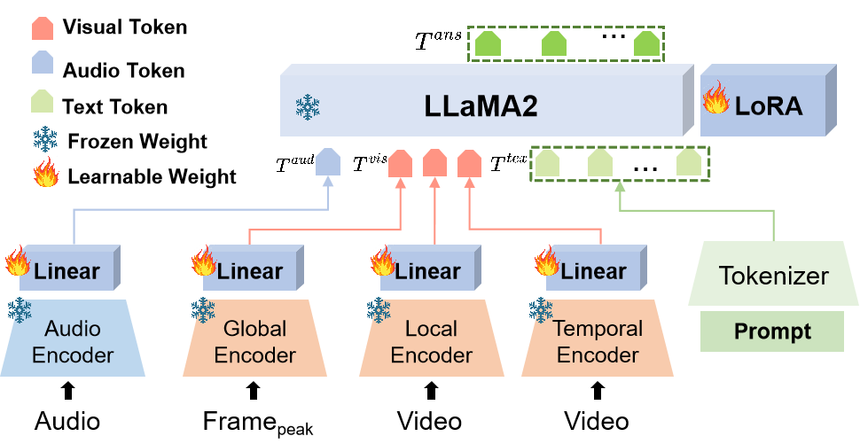

# Emotion-LLaMA
{: .fs-9 }

Multimodal Emotion Recognition and Reasoning with Instruction Tuning
{: .fs-6 .fw-300 }

[Get Started](getting-started/){: .btn .btn-primary .fs-5 .mb-4 .mb-md-0 .mr-2 }
[View on GitHub](https://github.com/ZebangCheng/Emotion-LLaMA){: .btn .fs-5 .mb-4 .mb-md-0 .mr-2 }
[Try Demo](https://huggingface.co/spaces/ZebangCheng/Emotion-LLaMA){: .btn .fs-5 .mb-4 .mb-md-0 }

---

## 📢 News

**[2025.07.09]** 🔥 We release the MERR dataset construction strategy at [MER-Factory](https://github.com/Lum1104/MER-Factory)!

**[2024.09.27]** 🎉 Our Emotion-LLaMA has been accepted at **NeurIPS 2024**!

**[2024.09.07]** 🥉 We achieved **third place** in the MER-OV track of the MER2024 Challenge. Emotion-LLaMA is the highest-scoring model among all individual models.

**[2024.07.10]** 🏆 Building on Emotion-LLaMA, we won the **championship** in the MER-Noise track of the MER2024 Challenge.

**[2024.06.12]** 🔥 We have deployed an [online demo](https://huggingface.co/spaces/ZebangCheng/Emotion-LLaMA) of Emotion-LLaMA on Hugging Face.

---

## 🚀 Overview

Accurate emotion perception is crucial for various applications, including human-computer interaction, education, and counseling. However, traditional single-modality approaches often fail to capture the complexity of real-world emotional expressions, which are inherently multimodal. Moreover, existing Multimodal Large Language Models (MLLMs) face challenges in integrating audio and recognizing subtle facial micro-expressions.

To address these issues, we introduce the **MERR dataset**, containing 28,618 coarse-grained and 4,487 fine-grained annotated samples across diverse emotional categories. This dataset enables models to learn from varied scenarios and generalize to real-world applications.

Additionally, we propose **Emotion-LLaMA**, a model that seamlessly integrates audio, visual, and textual inputs through emotion-specific encoders. By aligning features into a shared space and employing a modified LLaMA model with instruction tuning, Emotion-LLaMA significantly enhances both emotional recognition and reasoning capabilities.



---

## ✨ Key Features

- **Multimodal Integration**: Seamlessly combines audio, visual, and textual inputs for comprehensive emotion understanding
- **MERR Dataset**: Comprehensive dataset with 28,618 coarse-grained and 4,487 fine-grained annotations
- **State-of-the-art Performance**: Achieves top scores on multiple benchmarks including EMER, MER2023, and DFEW
- **Instruction Tuning**: Enhanced emotional reasoning capabilities through multi-task instruction tuning
- **Open Source**: Fully available for research purposes with comprehensive documentation

---

## 🎯 Quick Links

<div class="grid">
  <div class="grid-item">
    <h3>Getting Started</h3>
    <p>Set up Emotion-LLaMA in minutes</p>
    <a href="getting-started/">Installation Guide →</a>
  </div>
  
  <div class="grid-item">
    <h3>MERR Dataset</h3>
    <p>Explore our comprehensive emotion dataset</p>
    <a href="dataset/">Dataset Overview →</a>
  </div>
  
  <div class="grid-item">
    <h3>Training</h3>
    <p>Train your own Emotion-LLaMA model</p>
    <a href="training/">Training Guide →</a>
  </div>
  
  <div class="grid-item">
    <h3>Demo</h3>
    <p>Try Emotion-LLaMA online or locally</p>
    <a href="demo/">Demo Usage →</a>
  </div>
</div>

---

## 📊 Performance Highlights

### MER2023 Challenge
- **F1 Score: 0.9036** (Audio, Visual, Text)
- Best performance among all methods

### EMER Dataset
- **Clue Overlap: 7.83** (Best among MLLMs)
- **Label Overlap: 6.25** (Best among MLLMs)

### MER2024 Challenge
- **Championship** in MER-Noise track
- **3rd Place** in MER-OV track (highest individual model)

---

## 🔬 Research Paper

More details about Emotion-LLaMA are available in our [NeurIPS 2024 paper](https://arxiv.org/pdf/2406.11161).

If you find our work helpful for your research, please consider giving a star ⭐ and citing our paper:

```bibtex
@inproceedings{NEURIPS2024_c7f43ada,
  author = {Cheng, Zebang and Cheng, Zhi-Qi and He, Jun-Yan and Wang, Kai and Lin, Yuxiang and Lian, Zheng and Peng, Xiaojiang and Hauptmann, Alexander},
  booktitle = {Advances in Neural Information Processing Systems},
  title = {Emotion-LLaMA: Multimodal Emotion Recognition and Reasoning with Instruction Tuning},
  year = {2024}
}
```

---

## 📞 Contact

Feel free to contact us if you have any questions or suggestions!

- **GitHub Issues**: [Report issues or ask questions](https://github.com/ZebangCheng/Emotion-LLaMA/issues)
- **Paper**: [Read our NeurIPS 2024 paper](https://arxiv.org/pdf/2406.11161)
- **Demo**: [Try the online demo](https://huggingface.co/spaces/ZebangCheng/Emotion-LLaMA)

